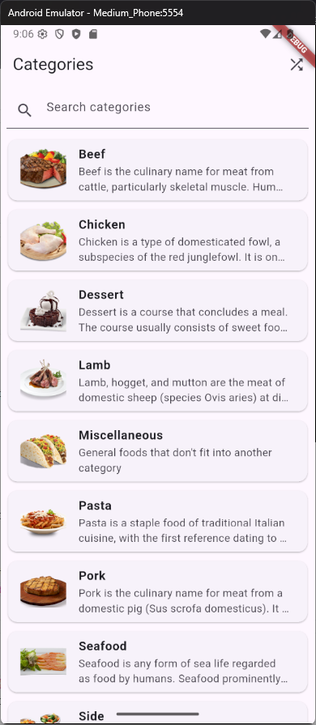
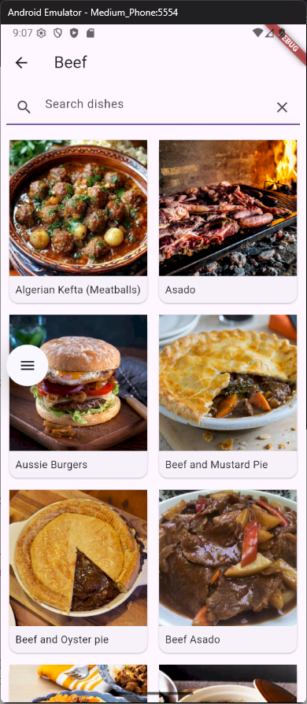
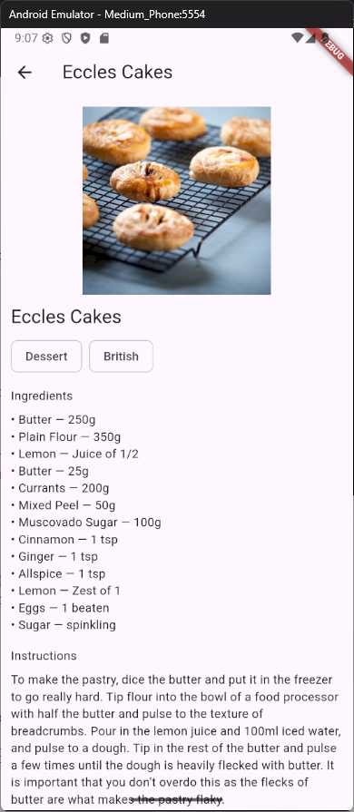

# Lab 1 - Exam Schedule 

This lab focuses on displaying and managing exam schedules, including lists of all exams, upcoming exams, and overdue exams.

List of Exams

Upcoming Exams

Overdue Exams

# Lab 2 - Recipe Display

This lab is about using an API of TheMealDB to take recipes and list them sorted by catagory and showing every recipe individually with detailed instructions and a youtube link, also having a random meal button in the front page.

Front Page

Beef Category Recipes

Recipe Instructions

